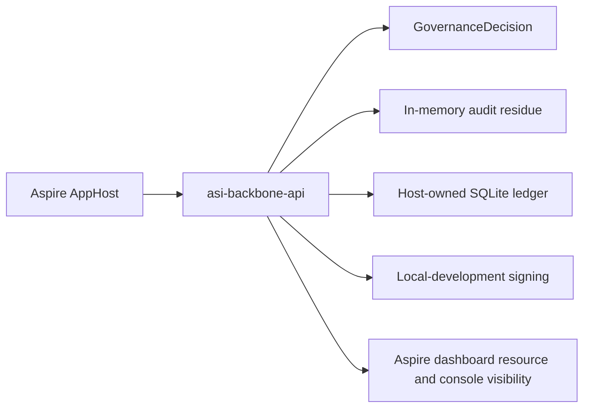

# Aspire AppHost Sample

The Aspire AppHost sample explores local orchestration for AsiBackbone-enabled systems without turning Aspire into a required dependency for the package family.

> [!IMPORTANT]
> This is a local development sample. It is not a production deployment recipe, compliance certification, managed-key implementation, durable infrastructure guarantee, or production tamper-evidence claim.

## Decision: sample first, package later only if justified

Issue #244 asks whether Aspire should be a package, sample, or both. The current repository boundary points to a **sample-first** approach:

- Core must remain framework-neutral and free of ASP.NET Core, EF Core, Aspire, cloud SDK, and test-package dependencies.
- The stable package family already has separate provider packages for ASP.NET Core, EF Core, OpenTelemetry, signing, testing, and analyzers.
- Aspire is primarily a local orchestration and developer-experience layer for distributed applications.
- The immediate value is showing how the existing governed ASP.NET Core sample can be launched and inspected from one local AppHost.

A future `CDCavell.AsiBackbone.Aspire` package may make sense only if reusable Aspire resource extensions emerge that are valuable outside this repository's samples.

## Sample location

```text
samples/AsiBackboneAspireAppHost/
```

The sample AppHost references the existing Plain ASP.NET Core host sample:

```text
samples/PlainAspNetCoreHost/
```

## What the AppHost models



The AppHost sets a local SQLite connection string for the sample API and starts the governed API as an Aspire project resource. The API itself owns policy evaluation, audit residue, local-development signing, EF Core ledger persistence, and endpoint-governance middleware.

## Run locally

From the repository root:

```powershell
dotnet run --project samples/AsiBackboneAspireAppHost/CDCavell.AsiBackbone.Samples.AspireAppHost.csproj
```

Then use the Aspire dashboard to open the `asi-backbone-api` resource endpoint.

Useful sample paths:

```http
GET /sample/decision
GET /sample/audit/{correlationId}
GET /sample/ledger/{correlationId}
POST /sample/ergonomic/minimal
POST /sample/ergonomic/controller
```

## Dashboard visibility

The Aspire dashboard should provide local visibility into the `asi-backbone-api` resource and its runtime output. The primary governance evidence still comes from the API response and follow-up audit/ledger endpoints:

- `GovernanceDecision` outcome,
- reason codes,
- correlation ID,
- audit event ID,
- ledger record ID,
- canonical hash,
- local-development signing metadata,
- verification status.

Deeper governance-emission visibility through OpenTelemetry remains a future enhancement for this sample. The stable OpenTelemetry provider is still optional and does not become required by the AppHost sample.

## Local resources and substitutes

| Concern | Sample choice | Boundary |
| --- | --- | --- |
| API host | Existing Plain ASP.NET Core host sample | Host-owned execution remains inside the API. |
| Database | Local SQLite connection string passed by the AppHost | Local validation only; production hosts own provider, migrations, backups, and retention. |
| Signing | `CDCavell.AsiBackbone.Signing.LocalDevelopment` in the API sample | Not production key custody or legal non-repudiation. |
| Telemetry/dashboard | Aspire dashboard resource and console visibility | Helpful for local debugging; not compliance evidence. |
| Governance emission | Future OpenTelemetry sample extension | Optional; local audit/ledger records remain the first evidence boundary. |

## Why this stays optional

Aspire is valuable for distributed local development, but it should not change the dependency posture of the package family:

- `CDCavell.AsiBackbone.Core` stays dependency-light.
- ASP.NET Core and EF Core remain separate provider/integration packages.
- Aspire stays in `samples/` and in documentation.
- Cloud Key Vault, production databases, managed keys, and external telemetry backends are not required for this local path.

## CI validation posture

The AppHost project is included in the solution so normal restore/build validation can catch compile issues. The CI workflow does not need to start the AppHost or require containers, cloud resources, production databases, or managed keys.

## Related documentation

- [Plain ASP.NET Core Host Sample](plain-aspnetcore-host-sample.md)
- [Reference Deployment: Plain ASP.NET Core Host Evidence](reference-deployment.md)
- [OpenTelemetry Governance Emission Provider](opentelemetry-governance-emission-provider.md)
- [Production Wording and Stable Signing Boundaries](production-wording-and-alpha-limitations.md)
