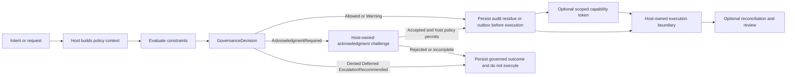
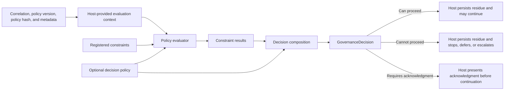
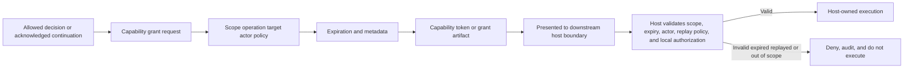
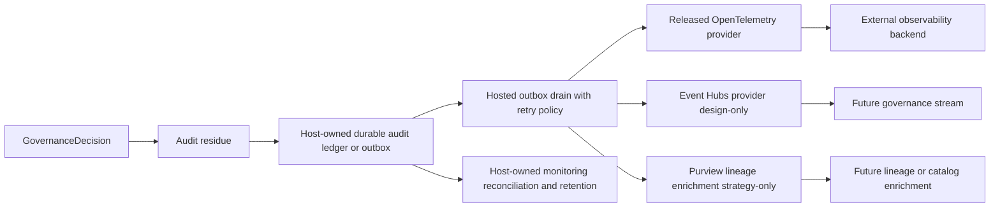

# Core Governance Flow Diagrams

This page provides lightweight Mermaid diagrams for the main AsiBackbone governance flows. The diagrams are intentionally implementation-facing: they show where the package family can help structure policy evaluation, acknowledgment, audit residue, capability boundaries, and optional governance emission without claiming that AsiBackbone owns the host application's execution path.

> [!IMPORTANT]
> In this software project, **ASI** means **Accountable Systems Infrastructure**. AsiBackbone is a governance spine for accountable software decision flow, not an intelligence engine, model host, robotics controller, compliance certification system, or production tamper-evidence provider by itself.

## How to read these diagrams

- **Host-owned execution** means the consumer application still owns authorization, business rules, side effects, infrastructure access, database provider choices, retries, and operational safeguards.
- **Released provider** means a package exists in the stable package family.
- **Design-only** or **strategy-only** means the surface is documentation or future-provider strategy unless a later stable release explicitly ships it.
- **Audit residue** and **outbox records** are governance records. They do not replace host security controls, legal review, operational monitoring, or production key custody.

## Intent-to-execution spine

This diagram shows the highest-level flow: a request enters the governance spine, receives a decision, may require acknowledgment, may produce audit residue or outbox records, and only reaches execution through a host-owned boundary.



**Caption:** AsiBackbone structures the decision spine. The host remains responsible for execution and for refusing execution when the decision, acknowledgment state, capability scope, or local policy does not permit continuation.

## Policy evaluator pipeline

This diagram shows the framework-neutral policy-evaluation shape. The host supplies context and policy components; AsiBackbone composes results into a `GovernanceDecision`; the host branches on the result.



**Caption:** The evaluator returns structured decision data. It does not execute the requested operation and does not replace host authorization or business-policy enforcement.

## Dynamic Liability Handshake sequence

The Dynamic Liability Handshake is a reflexive acknowledgment pattern for consequential actions. It records that an actor was presented with a structured challenge and responded, but it is not by itself a legal waiver, authorization grant, or production compliance guarantee.

```mermaid
sequenceDiagram
    actor Actor
    participant Host as Host application
    participant Backbone as AsiBackbone policy layer
    participant Handshake as Acknowledgment challenge service
    participant Audit as Audit sink or outbox

    Actor->>Host: Proposes or requests consequential action
    Host->>Backbone: Evaluate policy context
    Backbone-->>Host: GovernanceDecision AcknowledgmentRequired
    Host->>Handshake: Create challenge with reason codes and context
    Handshake-->>Actor: Present consequences and acknowledgment text
    Actor-->>Handshake: Accepts or rejects challenge
    Handshake-->>Host: Acknowledgment result
    Host->>Audit: Persist decision and acknowledgment residue

    alt Accepted and host policy still permits continuation
        Host->>Host: Continue through host-owned execution boundary
    else Missing, rejected, expired, or host policy blocks
        Host-->>Actor: Do not execute governed action
    end
```

**Caption:** The handshake makes acknowledgment explicit and auditable. The host still owns identity, authorization, UI, response handling, persistence, and final execution behavior.

## Capability token scoping and expiration

Capability-token primitives can help model a narrow grant after a governance decision, but the host or provider implementation must still enforce scope, expiry, replay handling, custody, and downstream authorization.



**Caption:** A token is not broad execution authority. It is only useful when the host validates the exact scope and refuses continuation outside that scope.

## Durable outbox and governance emission path

This diagram separates local durable governance records from optional external observability and governance-enrichment systems. Local persistence should remain the first reliability boundary; external emission is additive.



**Caption:** External emission does not substitute for local durable records, host-owned retry behavior, dead-letter handling, retention policy, or production signing and key-management choices.

## Placement summary

| Diagram | Primary documentation use | Boundary reminder |
| --- | --- | --- |
| Intent-to-execution spine | First explanation of the governance backbone shape. | Host owns execution. |
| Policy evaluator pipeline | Core policy and constraint composition. | Evaluator returns decisions only. |
| Dynamic Liability Handshake | Acknowledgment-required decisions. | Acknowledgment is auditable intent recognition, not authorization by itself. |
| Capability token scoping | Scoped continuation after an allowed or acknowledged decision. | Host must validate scope and expiration. |
| Durable outbox and governance emission | Audit persistence and provider emission. | External systems are additive; design-only providers are labeled as such. |

These diagrams are meant to reduce onboarding friction without expanding implementation claims beyond the shipped package boundaries.