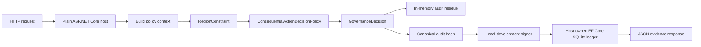

# Reference Deployment: Plain ASP.NET Core Host Evidence

This page documents the in-repository reference deployment path for AsiBackbone: the `samples/PlainAspNetCoreHost` application. It is intended to answer the practical adopter question: "What does this look like when it is actually wired into a host?"

> [!IMPORTANT]
> This is a repeatable local reference deployment, not a public hosted production deployment, compliance certification, or production tamper-evidence claim. It shows AsiBackbone operating as Accountable Systems Infrastructure inside a realistic ASP.NET Core host while preserving the boundary that the host owns execution, persistence choices, deployment, credentials, monitoring, and operational safeguards.

## Evidence summary

| Evidence item | Where it appears | What it proves |
| --- | --- | --- |
| Plain ASP.NET Core host | `samples/PlainAspNetCoreHost/` | AsiBackbone can run without `NetCoreApplicationTemplate` or a custom application template. |
| Policy evaluation | `GET /sample/decision` | The host builds policy context and receives a structured `GovernanceDecision`. |
| Acknowledgment-required decision | `risk=consequential` sample metadata | A host decision policy can require acknowledgment before continuation. |
| Audit residue | in-memory audit ledger | The decision is written to a local inspectable audit path. |
| Durable host-owned ledger | SQLite through a host-owned EF Core `DbContext` | The host can persist audit ledger records while owning provider, connection string, migrations, and deployment. |
| Signing-ready artifact | local-development signing service | Canonical hash, signature metadata, and verification output can be attached in a local validation path. |
| Endpoint governance ergonomics | `/sample/ergonomic/minimal` and `/sample/ergonomic/controller` | Endpoint metadata can require governance policy, liability handshake, capability grant, and audit emission. |

## Architecture



**Boundary:** AsiBackbone participates in policy evaluation, audit residue, signing-ready metadata, and ASP.NET Core endpoint governance. The sample host owns the web application, database provider, connection string, database creation, endpoint behavior, and any decision to continue or stop execution.

## Run the reference deployment locally

From the repository root:

```powershell
dotnet run --project samples/PlainAspNetCoreHost/CDCavell.AsiBackbone.Samples.PlainAspNetCoreHost.csproj
```

Then request the sample decision endpoint:

```http
GET /sample/decision
```

The sample also redirects `/` to `/sample/decision`, so opening the local application root gives a quick first evidence path.

## Request flow

The `GET /sample/decision` path demonstrates this sequence:

1. ASP.NET Core receives the request.
2. The host sets the correlation identifier from `HttpContext.TraceIdentifier`.
3. The host builds an `AsiBackboneConstraintEvaluationContext` with sample metadata:
   - `region=US-LA`
   - `risk=consequential`
   - `intent=external-api-call`
4. `RegionConstraint` verifies that the request has a region or endpoint policy metadata.
5. `ConsequentialActionDecisionPolicy` turns a consequential request into an `AcknowledgmentRequired` decision.
6. The host creates `AuditResidue` for `sample.external-api-call`.
7. The sample writes audit residue to the in-memory ledger.
8. The sample builds a canonical audit-ledger payload and hash.
9. The local-development signing service signs and verifies the hash for validation purposes.
10. The host persists an EF Core audit ledger record through the sample-owned SQLite `DbContext`.
11. The endpoint returns a JSON evidence response.

## Example decision response

The exact IDs and hash values are generated at runtime. The shape below is representative of what the endpoint returns:

```json
{
  "decision": "AcknowledgmentRequired",
  "canProceed": false,
  "requiresAcknowledgment": true,
  "reasonCodes": [
    "sample.acknowledgment.required"
  ],
  "correlationId": "0HMSAMPLETRACE:00000001",
  "policyVersion": "sample-policy-v1",
  "policyHash": "sample-policy-hash",
  "auditEventId": "f4b3f67a-8d33-4d69-9b1a-1d6c26c9a8a4",
  "ledgerRecordId": "8d65c774-d984-42df-8fd8-cffce3b90ac2",
  "canonicalHash": "sha256:sample-canonical-hash-value",
  "signing": {
    "isSigned": true,
    "keyId": "sample-local-dev-key",
    "keyVersion": "dev",
    "signatureAlgorithm": "HMACSHA256",
    "provider": "local-development",
    "signedUtc": "2026-06-20T12:00:00Z"
  },
  "verification": {
    "isValid": true,
    "status": "Valid",
    "failureCode": null
  }
}
```

The important evidence is not the specific generated identifiers. The important evidence is that one local request produces a structured decision, reason codes, correlation metadata, audit residue identifier, ledger record identifier, canonical hash, signing metadata, and verification result.

## Inspect audit and ledger output

Use the returned `correlationId` to inspect both audit paths:

```http
GET /sample/audit/{correlationId}
GET /sample/ledger/{correlationId}
```

The in-memory audit endpoint demonstrates immediate local inspection. The ledger endpoint demonstrates host-owned EF Core persistence. In the sample, SQLite is a local validation provider; a consuming production host would still own database provider selection, migrations, retention, backup, access control, and deployment.

A representative audit or ledger record should show fields such as:

```json
{
  "operationName": "sample.external-api-call",
  "correlationId": "0HMSAMPLETRACE:00000001",
  "policyVersion": "sample-policy-v1",
  "policyHash": "sample-policy-hash",
  "reasonCodes": [
    "sample.acknowledgment.required"
  ],
  "metadata": {
    "region": "US-LA",
    "risk": "consequential",
    "intent": "external-api-call",
    "sample_signing_status": "signed",
    "sample_verification_status": "Valid"
  }
}
```

## Endpoint governance evidence

The sample also includes endpoint-governance metadata on both Minimal API and controller-action paths:

```http
POST /sample/ergonomic/minimal
POST /sample/ergonomic/controller
```

Those endpoints demonstrate the ASP.NET Core integration shape:

```csharp
.RequireGovernancePolicy<SampleEndpointPolicy>()
.RequireLiabilityHandshake()
.RequireCapabilityGrant("sample.high-risk.execute")
.EmitGovernanceAudit();
```

The controller version uses the equivalent attributes:

```csharp
[RequireGovernancePolicy(typeof(SampleEndpointPolicy))]
[RequireLiabilityHandshake]
[RequireCapabilityGrant("sample.high-risk.execute")]
[EmitGovernanceAudit]
```

These paths are useful as evidence that endpoint metadata can carry governance requirements into middleware, but the sample still keeps execution host-owned. The endpoint body returns only after endpoint-governance metadata has been evaluated by the ASP.NET Core integration path.

## What this reference deployment does not claim

This reference deployment does not claim that AsiBackbone:

- is a hosted public service,
- is an intelligence engine,
- hosts, trains, prompts, or runs AI models,
- executes external tools, infrastructure changes, robotics, or physical-control flows,
- certifies legal, regulatory, or audit-framework compliance,
- provides production immutability or tamper-evidence by default,
- owns production key custody, monitoring, retention, backup, or migration strategy.

The local-development signer is for samples and validation only. The SQLite database is a local host-owned validation choice. External governance emission, durable outbox drains, managed-key signing, DLP/classification, and production operational controls must be explicitly selected and deployed by the consuming host.

## Repeatable adopter checklist

A skeptical adopter can validate the reference path by confirming that one local run can produce:

- a structured `GovernanceDecision`,
- an acknowledgment-required result for consequential metadata,
- reason codes,
- a correlation identifier,
- in-memory audit residue,
- a durable EF Core audit ledger record,
- canonical hash metadata,
- local-development signing and verification metadata,
- endpoint metadata requiring policy, acknowledgment, capability scope, and audit emission.

That is the practical evidence boundary for this sample: a working governance spine around a realistic ASP.NET Core host, not a production deployment claim.

## Related documentation

- [Plain ASP.NET Core Host Sample](plain-aspnetcore-host-sample.md)
- [First 15 Minutes: Standard API Gating](quickstart-api-gating.md)
- [ASP.NET Core Endpoint Governance](aspnetcore-endpoint-governance.md)
- [Host-Owned Execution Enforcement](host-owned-execution-enforcement.md)
- [Durable Audit and Outbox Persistence](durable-audit-outbox-persistence.md)
- [Production Wording and Stable Signing Boundaries](production-wording-and-alpha-limitations.md)
