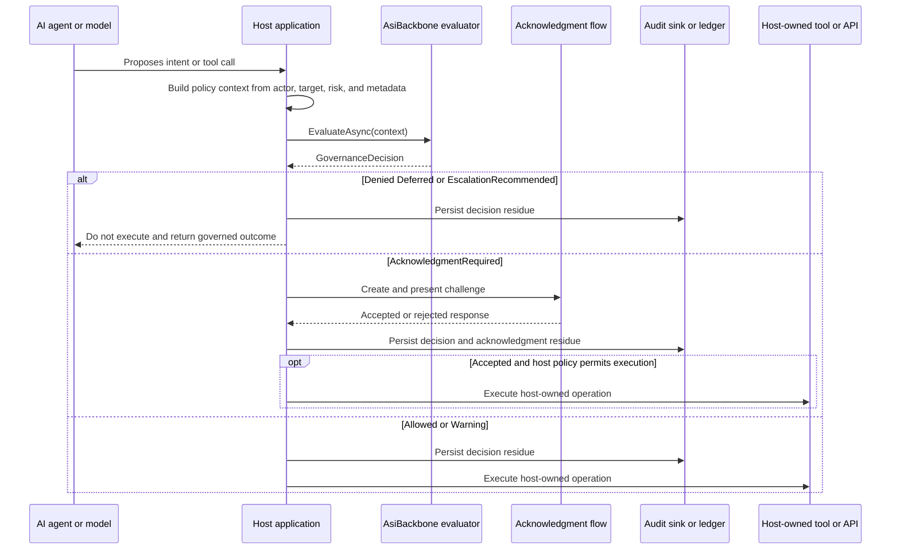

# AI Agent Gateway Scenario

AsiBackbone can be used as a governance checkpoint between an AI agent's proposed action and the host application's execution boundary.

In this scenario, the model or agent proposes intent. The host application converts that proposal into a framework-neutral evaluation context. AsiBackbone evaluates policy constraints and decision policy. The host then decides whether to deny, defer, escalate, require acknowledgment, persist audit residue, or execute the host-owned tool.

> [!IMPORTANT]
> AsiBackbone is not an AI agent framework. It does not host, train, run, prompt, or orchestrate the model. It does not execute tools, APIs, infrastructure changes, file operations, external commands, robotics flows, or physical-control operations. The host application owns the agent runtime, tool registry, authorization, acknowledgment UX, execution behavior, and operational safeguards.

## Responsibility boundary

| Participant | Responsibility |
| --- | --- |
| AI agent or model | Proposes an intent or tool call. It does not receive direct execution authority from AsiBackbone. |
| Host application | Owns the model runtime, tool registry, actor context, authorization, policy-context construction, final execution, and error handling. |
| AsiBackbone | Evaluates the host-provided context through constraints and decision policy, then returns a governance decision. |
| Acknowledgment layer | Handles host-presented acknowledgment for consequential actions when the decision requires it. |
| Audit sink or ledger | Stores the decision residue, reason codes, policy metadata, correlation identifiers, and host-provided metadata. |
| External tool or API | Executes only if the host decides the governed action may proceed. |

## Sequence



## Evaluation flow

A typical AI-agent gateway flow is:

1. Agent proposes an intent or tool call.
2. Host validates the proposal shape and builds an evaluation context.
3. Host includes correlation, policy version, policy hash, actor, operation, risk, target, and tool metadata where appropriate.
4. AsiBackbone constraints and decision policy evaluate the request.
5. AsiBackbone returns a `GovernanceDecision`.
6. Host persists audit residue from the decision.
7. Host handles `AcknowledgmentRequired` decisions before execution.
8. Host executes, denies, defers, or escalates through host-owned code.

The important pattern is that the agent proposes; the host governs.

## Example intents

| Agent-proposed intent | Possible host metadata | Example governance posture |
| --- | --- | --- |
| Delete a file | `operation=file.delete`, `target.path`, `risk=high` | Deny protected paths; require acknowledgment for approved cleanup paths; audit every decision. |
| Send an external notification | `operation=notification.send`, `target.system`, `risk=medium` | Allow low-risk destinations; warn or require acknowledgment for broad external distribution. |
| Approve a workflow step | `operation=workflow.approve`, `workflow.id`, `risk=high` | Require acknowledgment or escalation when the approval has business, legal, or administrative impact. |
| Call an external API | `operation=api.call`, `api.name`, `risk=variable` | Allow known low-risk calls; defer when rate limits, outages, or missing policy metadata require later evaluation. |

These examples are intentionally host-owned. AsiBackbone can evaluate and record the governance decision, but the application decides whether and how any file operation, notification, workflow approval, or API call is actually performed.

## Minimal implementation sketch

The host should convert an agent proposal into an evaluation context before any tool execution occurs.

```csharp
IReadOnlyDictionary<string, string> metadata = new Dictionary<string, string>(StringComparer.Ordinal)
{
    ["agent.id"] = "support-agent-v1",
    ["agent.intent"] = "notification.send",
    ["target.system"] = "external-notifications",
    ["risk"] = "medium"
};

var context = new AsiBackboneConstraintEvaluationContext(
    correlationId: correlationId,
    policyVersion: "agent-gateway-v1",
    policyHash: policyHash,
    metadata: metadata);

GovernanceDecision decision = await evaluator.EvaluateAsync(
    context,
    cancellationToken);
```

The host then branches on the returned outcome.

```csharp
switch (decision.Outcome)
{
    case GovernanceDecisionOutcome.Allowed:
    case GovernanceDecisionOutcome.Warning:
        // Persist audit residue first, then execute through host-owned tool code.
        break;

    case GovernanceDecisionOutcome.AcknowledgmentRequired:
        // Present a host-owned acknowledgment flow before any execution.
        break;

    case GovernanceDecisionOutcome.Denied:
    case GovernanceDecisionOutcome.Deferred:
    case GovernanceDecisionOutcome.EscalationRecommended:
        // Persist audit residue and do not execute the tool call here.
        break;
}
```

After evaluation, the host can create audit residue from the decision.

```csharp
AuditResidue residue = AuditResidue.FromDecision(
    actor,
    operationName: "agent.notification.send",
    decision,
    metadata: metadata);

await auditSink.WriteAsync(residue, cancellationToken);
```

For durable persistence, the host can map audit residue into its host-owned persistence plan, such as an EF Core ledger store. The host remains responsible for database provider, connection strings, migrations, retention, and deployment.

## Acknowledgment-required actions

When a decision returns `AcknowledgmentRequired`, the host should pause before execution.

An ASP.NET Core host can use `IAsiBackboneAcknowledgmentChallengeService` to create and handle a challenge without forcing a specific UI framework. The host still owns how the challenge is displayed, who is authorized to respond, how the response is persisted, and whether a successful acknowledgment is sufficient to proceed.

A useful rule is:

```text
No acknowledgment, no consequential execution.
```

The acknowledgment should be treated as part of the governance record, not as a substitute for authorization, policy, or operational controls.

## What this pattern prevents

This gateway pattern helps avoid common agent-integration mistakes:

- Treating model output as execution authority.
- Hiding decision logic inside prompt text.
- Scattering policy checks across individual tool handlers.
- Logging only after the tool has already executed.
- Treating user approval as the same thing as structured acknowledgment.
- Allowing high-risk operations without correlation, reason codes, policy version, or audit residue.

## Relevant APIs and samples

Core classes and interfaces:

- [`IAsiBackbonePolicyEvaluator<TContext>`](../../../src/AsiBackbone.Core/Evaluation/IAsiBackbonePolicyEvaluator.cs)
- [`AsiBackboneConstraintEvaluationContext`](../../../src/AsiBackbone.Core/Constraints/AsiBackboneConstraintEvaluationContext.cs)
- [`GovernanceDecision`](../../../src/AsiBackbone.Core/Decisions/GovernanceDecision.cs)
- [`GovernanceDecisionOutcome`](../../../src/AsiBackbone.Core/Decisions/GovernanceDecisionOutcome.cs)
- [`AuditResidue`](../../../src/AsiBackbone.Core/Audit/AuditResidue.cs)
- [`IAsiBackboneAcknowledgmentChallengeService`](../../../src/AsiBackbone.AspNetCore/Handshakes/IAsiBackboneAcknowledgmentChallengeService.cs)

Related documentation:

- [Policy Evaluator Pipeline](../policy-evaluator-pipeline.md)
- [Adoption and Target Use Cases](../use-cases.md)
- [ASP.NET Core Integration Boundary](../aspnetcore-integration-boundary.md)
- [Plain ASP.NET Core Host Sample](../plain-aspnetcore-host-sample.md)

## Adoption note

Start with one low-risk or simulated tool path before placing AsiBackbone in front of production agent execution. A good first validation is a simulated external-command endpoint that returns the proposed tool call, the governance decision, the audit event identifier, and the reason codes without executing the external action.
