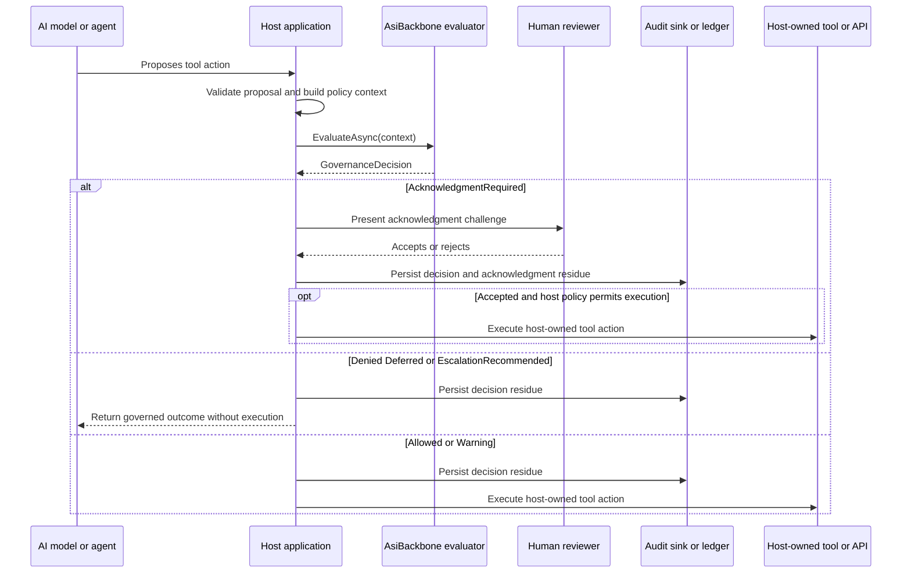

# Human Approval Before AI Tool Execution Scenario

AsiBackbone can help a host application pause an AI-proposed tool action until policy has been evaluated and a human has accepted or rejected an acknowledgment challenge.

This scenario is narrower than a full AI agent gateway. It focuses specifically on the point where an AI proposes an action, the host evaluates policy, and the decision requires human acknowledgment before any tool execution can continue.

> [!IMPORTANT]
> AsiBackbone is not an AI agent runtime and does not execute tools. The host application owns the model runtime, tool registry, authorization, user interface, acknowledgment presentation, and final execution decision.

## Core flow

```text
AI proposes action
  -> Host builds policy context
  -> AsiBackbone evaluates policy
  -> Decision requires acknowledgment
  -> Human accepts or rejects
  -> Host decides whether to execute
```

## Responsibility boundary

| Participant | Responsibility |
| --- | --- |
| AI model or agent | Proposes an action or tool call. |
| Host application | Validates proposal shape, builds policy context, presents acknowledgment, and owns final execution. |
| AsiBackbone | Evaluates constraints and returns a governance decision. |
| Human reviewer | Accepts or rejects the acknowledgment challenge when required. |
| Audit sink or ledger | Preserves decision residue and acknowledgment residue. |
| Tool or API | Executes only if the host decides execution may proceed. |

## Sequence



## Example tool proposals

| AI-proposed action | Example policy factors | Example governance posture |
| --- | --- | --- |
| Send a message outside the organization | recipient domain, message type, actor, risk | Require acknowledgment for broad or sensitive distribution. |
| Update a workflow record | workflow state, actor type, target resource, policy version | Allow low-risk updates; require acknowledgment for consequential state changes. |
| Call an external API | API name, operation, destination, rate limit context | Defer missing metadata; require review for high-impact calls. |
| Prepare a data export | data category, destination, purpose, correlation ID | Deny prohibited exports; require acknowledgment for sensitive but allowed paths. |

## Implementation notes

The host should not treat AI output as execution authority. The AI proposes an action, but the host builds the policy context and decides what to do with the returned `GovernanceDecision`.

Useful metadata may include:

- agent or model identifier;
- proposed tool name;
- target resource;
- destination system;
- actor context;
- risk category;
- policy version and policy hash;
- correlation identifier;
- human reviewer identifier when an acknowledgment is completed.

When `AcknowledgmentRequired` is returned, the host can use ASP.NET Core acknowledgment challenge helpers or its own UI to present the challenge. A successful acknowledgment should be recorded as part of the governance trail, not treated as a replacement for authorization or operational controls.

## What this pattern helps prevent

- Treating AI-generated intent as permission to execute.
- Hiding tool governance inside prompts.
- Executing consequential tool calls before a human sees the risk.
- Recording only the final tool result without the policy decision that allowed it.
- Treating a click approval as separate from policy version, reason codes, and audit residue.

## Adoption note

Start with a simulated tool action that never calls a real external system. Return the proposed action, governance decision, acknowledgment result, and audit identifier to validate the pattern before connecting it to production tool execution.
